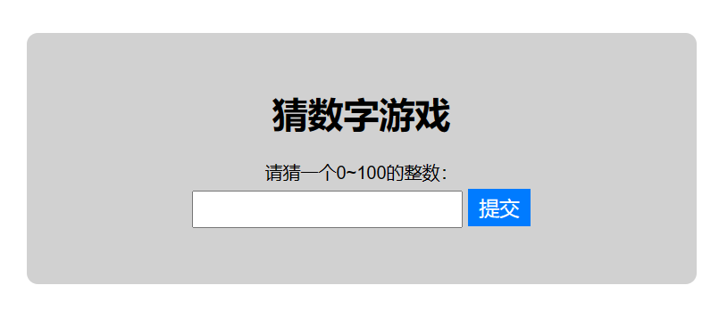

# 前端游戏小项目
跟着CSDN上的前端大神写前端小游戏，目的是为了练习自己的写代码能力！
## day1: 猜数字游戏
### 功能介绍
要求我们猜出一个1-100之间的整数，用户可以在输入框输入自己猜测的数字点击提交，会根据我们的猜测给出提示，太大了/太小了，我们可以根据提示继续进行猜测，答对后提示我们答对了并且出现在玩一次的按钮，点击再玩一次重新开始；当然我们可以自己规定规则，大家可以自己修改变成更棒的小游戏！

### 页面搭建
#### DOM构建

```html
<div class="container">
    <h1>猜数字游戏</h1>
    <div class="input-group">
        <label for="guess">请猜一个1~100的整数：</label>
        <input type="text" id="guess">
        <button id="submit">提交</button>
    </div>
    <div class="result"></div>
    <div class="message"></div>
    <button id="play-again" 
    class="play-again" 
    style="display: none;">再玩一次</button>
</div>
```
#### 样式设置
```css
* {
    font-family: Arial, sans-serif;
    box-sizing: border-box;
}

.container {
    margin: 50px auto;
    max-width: 600px;
    text-align: center;
    background-color: #d1d1d1;
    padding: 30px;
    border-radius: 10px;
}

h1 {
    font-size: 32px;
}

.input-group {
    margin-bottom: 20px;
}

label {
    display: block;
    margin-bottom: 5px;
}

input[type='text'] {
    font-size: 18px;
    padding: 5px 10px;
}

button {
    font-size: 18px;
    padding: 5px 10px;
    background-color: #007bff;
    color: #ffffff;
    border: none;
    cursor: pointer;
}

button:hover {
    background-color: #0062cc;
}

.result {
    font-size: 24px;
    margin-bottom: 20px;
}

.message {
    font-size: 18px;
    margin-bottom: 20px;
}

.play-again {
    font-size: 18px;
    padding: 5px 10px;
    background-color: #007bff;
    color: #ffffff;
    border: none;
    cursor: pointer;
    margin: 0 auto;
}

.play-again:hover {
    background-color: #0062cc;
}
```

#### 逻辑部分
首先，随机生成一个1~100的随机数作为正确答案；然后使用选择器来获取页面中的元素。
```js
  // 随机生成数
  let answer = Math.floor(Math.random() * 100) + 1;
  //获取页面元素
  let input = document.getElementById("guess");
  let submit_btn = document.getElementById("submit");
  let result = document.querySelector(".result");
  let message = document.querySelector(".message");
  let play_again_btn = document.getElementById("play-again");
```
下面添加事件监听器来处理用虎的输入和提交事件。当用户点击提交按钮时，先获取用户输入框中的内容。首先，先验证用户输入的内容是否合法；如果不合法，则在提示信息中显示错误并结束函数执行
```js
// 处理提交事件
  submit_btn.addEventListener("click", function () {
    // 获取输入的内容
    let guess = input.value;
    let guess_num = parseInt(guess);
    // 验证输入的内容
    if (isNaN(guess) || guess_num < 1 || guess_num > 100) {
      result.textContent = "";
      message.textContent = "请输入1~100以内的整数！";
      return;
    }
  });
```
如果内容合法，则需要与正确答案进行比较。如果相等，则显示猜对了，并显示再玩一次按钮，同时禁用提交按钮；如果用户输入的数字小于正确答案，则提示太小了；如果用户输入的数字大于正确答案，则提示太大了。
```js
// 处理提交事件
  submit_btn.addEventListener("click", function () {
    // 获取输入的内容
    let guess = input.value;
    let guess_num = parseInt(guess);
    // 验证输入的内容
    if (isNaN(guess) || guess_num < 1 || guess_num > 100) {
      result.textContent = "";
      message.textContent = "请输入1~100以内的整数！";
      return;
    }

    // 比较用户输入的数字和答案
    if (guess_num === answer) {
      result.textContent = "恭喜你，答对了！";
      message.textContent = "";
      play_again_btn.style.display = "block";
      submit_btn.disabled = true;
    } else if (guess_num < answer) {
      message.textContent = "太小了，请继续！";
      result.textContent = "";
    } else {
      message.textContent = "太大了，请继续！";
      result.textContent = "";
    }
  });
```
当猜到答案之后，会显示再玩一次按钮。对再玩一次按钮进行事件监听。
首先，会重新生成一个随机整数，并清空用户输入的数字、提示信息和结果信息，同时隐藏再玩一次按钮，启用提交按钮。
```js
// 处理再玩一次事件
  play_again_btn.addEventListener("click", function () {
    // 重新生成随机数
    answer = Math.floor(Math.random() * 100) + 1;

    // 清空输入框和提示信息
    input.value = "";
    message.textContent = "";
    result.textContent = ""

    // 隐藏再玩一次按钮，启动提交按钮
    play_again_btn.style.display = 'none';
    submit_btn.disabled = false;
  });
```


